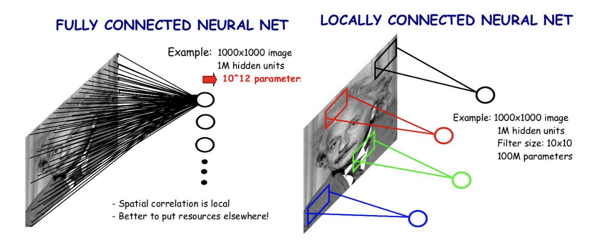

# 8/30~9/1 WIL ✏️

## 태욱 [[Github](https://github.com/K-ple)]

### ViT(Vision Transformer)

Self-attention 기반 구조를 이용한 Trnsformer를 자연어 처리 분야가 아닌 Computer Vision 분야에 적용한 네트워크이다.
#### 특징 

- Transformer의 Encoder부분(Self-attention)을 그대로 응용
- Vision Task에서 CNN을 이용하지 않고 충분한 퍼포먼스를 낼 수 있음

### NLP history from transfomer

- RNNs's problem : 순방향 통과 중 정보가 손실
- Bi-directionalRNNs's problem : 순방향과 역방향 패스는 모두 양방향 정보를 의미하게 됨

- Transformers : RNNs의 장기 의존성 처리의 문제점과 입력 문장을 전체적으로 한 번에 처리한다는 BRNNs의 문제점을 해결함


## 상유 [[Github](https://github.com/dhfpswlqkd)]
### DERT

#### 1. CNN backbone   
이미지를 CNN backbone에 입력하여 feature map을 출력으로 얻는다. `(C, H, W)`
#### 2. Positional Encoding   
feature map을 1x1 convolution을 통해 d 차원으로 감소시킨 후 `(d, HW)`로 변환한다. (HW가 시퀸스 수라고 생각하면 될 듯)
transformer와 같이 position encoding을 수행해준다. (~~사실 조금 다름~~)
#### 3. Transformer (틀린 부분 있을수도 있어요)   
NLP의 Transformer과 다르게 Decoder에서 object queries`(N, d)`를 입력한다. object queries는 object의 라벨과 위치를 예측한다. 또한 Decoder의 결과로 두 개의 결과가 나온다.
Decoder에서 포지션 임베딩은 self-Attention마다 더해준다. 포지션 임베딩 또한 학습이 가능하다.
#### 4. Prediction heads   
FFN(그냥 Linear)을 통해 Class`(N, 클래스 수+1)` 예측과 Bounding Box`(N, 4)` 예측을 한다.
#### 5. Match   
제안된 손실함수를 이용하여 최적의 매칭을 찾는다.

#### 손실함수
class Loss와 Box Loss로 나누어 진다. class Loss는 평범한거 같다.
Box Loss는 L1 loss와 GIoU를 활용한다.


## 지현 [[Github](https://github.com/jihyun-0611)]
### Introduction to Computer Vision

1. 머신러닝은 feature extraction과 classification이 분리되어 있다.
2. 머신러닝과 달리 딥러닝은 feature extraction 과 classification을 모델이 한 번에 처리한다.
3. Knowledge distillation

   

4. Image ⇒ projection of the 3D world onto an 2D image plane
5. **Computer vision == Visual perception & intelligence**
   - teach a machine “how to see and imagine”!
   - computer vision includes understanding human visual perception capability!

### CNN

## 윤서 [[Github](https://github.com/myooooon)]

### [CV 이론] 
### 2. CNN부터 ViT까지
#### CNN (Convolutional Neural Networks)
- CNN은 fully **locally** connected neural network로  local feature를 학습하고 parameter를 공유하여 fully connected neural network보다 적은 파라미터로 효과적인 이미지 학습이 가능하다.


- CNN은 많은 CV task의 backbone으로 사용된다.   
   ex) Image-level classification, Classification+Regression, Pixel-level classification

#### Receptive field in CNN
- 특정 CNN feature가 input의 어떤 영역으로부터 계산되어온 건지를 나타낸다.
- Receptive field size 계산 방법
   - K x K conv filter(stride 1), P x P pooling layer(stride 2)   
   : (P + K -1) x (P + K - 1)   


#### ViT (Vision Transformers)
- NLP에서 transformer 모델의 scaling success에 영향을 받아 만들어진 모델로 standard transformer를 이미지에 직접 적용한다.
- ViT는 decoder없이 encoder로만 이루어져 있다.

- Overall architecture (기본 과제 1에서 실습)   
   1. 이미지를 고정된 크기의 patch들로 나눈다.
   2. 각 patch를 embedding하고, 분류 작업을 위한 별도의 classification token을 결합한다.
   3. 공간 정보를 추가하기 위해 embedding 벡터에 positional embedding 벡터를 더한다.
   4. Transformer encoder에 넣어 output 벡터를 얻는다.
   5. Classification token의 값으로 분류를 수행한다.   


### 3. CNN 시각화와 데이터 증강

#### CNN 시각화
- CNN 모델 내부는 이해하기 어려운 black box라서 왜 좋은 성능을 보이는지, 어떻게 개선해야하는지 파악하기 어렵다. 모델의 행동을 분석하고 모델의 결과를 설명하기 위해 마치 debugging tool처럼 visualization tool을 이용한다.


#### Data augmentation
- Training dataset은 real data의 일부만을 반영하기 때문에 실제와는 차이가 존재한다. 이 차이를 줄이고 더 다양한 데이터를 채우기 위해 data augmentation을 진행한다.   
   ex) Brightness, Rotate, Crop, Affline, CutMix ...

- RandAugment : 여러 augmentation methods 중에 최적의 method sequence을 찾기 위해 자동으로 augmentation 실험을 진행하는 것

- Copy-Paste : 한 이미지의 segment를 다른 이미지와 합성하여 데이터를 생성하는 방법

- Video Motion Magnification : 보기 어려운 작은 motion을 증폭시켜 눈에 잘 띄도록 만드는 기법
   - Copy-paste와 결합하여 실제로 존재하지 않는 합성 데이터를 만들어낼 수 있다.


## 세연 [[Github](https://github.com/Yeon-ksy)] [[Velog](https://velog.io/@yeon-ksy/)]
### [CV 이론] 4. Segmentation & Detection
 - Segmentation 종류
    - Semantic segmentation = 같은 객체가 여러 개라도 구분하지 않음.
    - instance segmentation = 같은 객체라도 구분함.
    - Panoptic segmentation = 배경 부분 등 모든 Pixel을 다 segmentation함 (Semantic + instance)


- Fully connected vs. Fully convolutional
    - Fully connected layer : 출력이 고정된 벡터이고, 공간 좌표를 섞음.
    - Fully convolutional layer : 출력이 classification map이고, 공간 좌표를 가짐.
- Fully Convolutional Networks (FCN) 
    - Fully Convolutional = FC를 사용하지 않고, 오직 Convolutional만 사용한다는 뜻.
    - 임의의 크기의 입력이 들어오더라도 맞는 출력을 만듦.
    - skip connection을 통해 각 층의 정보를 뽑아와서 upsampling하여 해상도를 맞춘 후에, 이를 종합하여 최종 예측을 만듦.
    
- U-Net
   - contracting path = 이미지 특징 축소 과정 (encoder). 3x3 convolutions. 각 level마다 channel을 2배로 늘림.
    - Expanding path = 원본 이미지의 해상도를 출력 (decoder). 2x2 convolutions. 각 level마다 channel을 2배로 줄임.
        - 각 해상도 레벨에 맞는 contracting path feature을 가지고 와서 cat을 함.


### [CV 이론] 과제 1 : Understanding Vision Transformers
- timm (PyTorch Image Models)
   - PyTorch 기반의 이미지 모델 라이브러리
   - 다양한 사전 학습된 비전 모델들을 제공 (torchivision에서 제공하는 pretrained model보다 더 많은 모델을 제공한다고 함!)
   - 설치 : pip install timm
- Position embedding 시각화 (cosine similarity)

   
   - 각 패치마다의 Position embedding을 시각화한 것. 색이 노랑색에 가까울수록 attention이 높음. 
   - 각 패치 위치에 대한 attention이 높은 것을 볼 수 있음.
- Attention Matrix 시각화 (3번째 멀티 해드 예시)
   - `attention_matrix = torch.matmul(q, kT)`

      
   - 100 ~ 125에서 attention이 강한 것을 볼 수 있음.
   - **softmax(q, kT)를 하지 않는 이유**
      - softmax는 Attention Score를 확률 분포로 변환하여 visualization이 쉽지 않음.
      - 따라서, softmax Temperature을 설정하여 softmax를 조정할 수 있음.
      - softmax Temperature

         

         - Temperature가 1일 때,

            
         - Temperature가 10일 때,

            
         - Temperature가 30일 때,

            

### [CV 이론] 과제 1 : Understanding Vision Transformers           
   - pytorch-lightning
      - PyTorch에 대한 High-level 인터페이스를 제공하는 오픈소스 Python 라이브러리
      - 설치 : pip install pytorch-lightning

- logits
   ```
   def forward(self, pixel_values):
        outputs = self.vit(pixel_values=pixel_values)
        return outputs.logits
   ```
   - logits은 소프트맥스(Softmax) 또는 시그모이드(Sigmoid) 함수가 적용되기 전의 원시 점수을 의미함.
   
- nn.Module 클래스 / pl.LightningModule 클래스에서의 self
   ```
   def common_step(self, batch, batch_idx):
        pixel_values = batch['pixel_values']
        labels = batch['labels']
        logits = self(pixel_values)
        criterion = nn.CrossEntropyLoss()
        loss = criterion(logits, labels)
   ```
   - 여기서 logits = self(pixel_values)는 forward을 호출하여 pixel_values를 처리
      - self는 인스턴스를 의미하고 이는 pl.LightningModule 혹은 nn.model에 의해 자동으로 forward 메서드가 실행하므로 `self(pixel_values)`는 forward 호출

- `nn.CrossEntropyLoss()`
   - 위 코드에서 softmax 값이 아닌 logits로 loss를 계산하는 이유
      - `nn.CrossEntropyLoss()`에 softmax가 들어가 있으므로 softmax의 확률값이 아닌, logits으로 계산