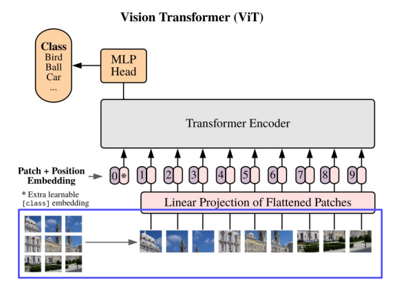
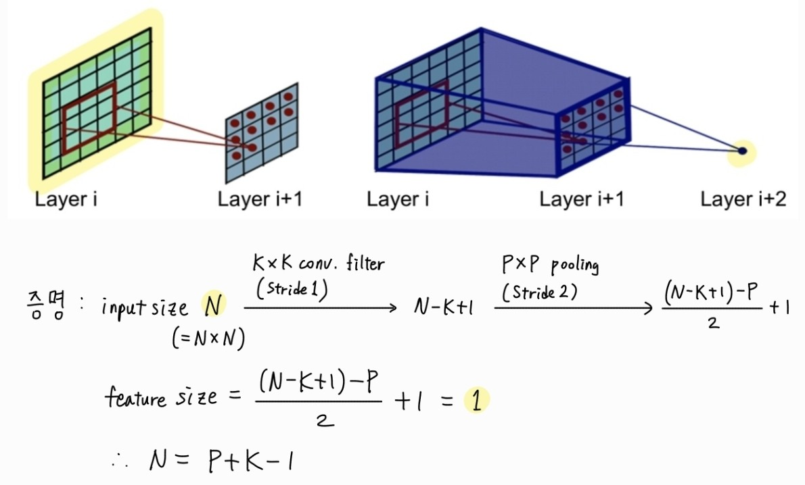

# 8/30~9/1 WIL ✏️

## 태욱 [[Github](https://github.com/K-ple)]

### ViT(Vision Transformer)


Self-attention 기반 구조를 이용한 Trnsformer를 자연어 처리 분야가 아닌 Computer Vision 분야에 적용한 네트워크이다.

#### 특징

- Transformer의 Encoder부분(Self-attention)을 그대로 응용
- Vision Task에서 CNN을 이용하지 않고 충분한 퍼포먼스를 낼 수 있음

### NLP history from transfomer

- RNNs's problem : 순방향 통과 중 정보가 손실
- Bi-directionalRNNs's problem : 순방향과 역방향 패스는 모두 양방향 정보를 의미하게 됨

- Transformers : RNNs의 장기 의존성 처리의 문제점과 입력 문장을 전체적으로 한 번에 처리한다는 BRNNs의 문제점을 해결함

## 상유 [[Github](https://github.com/dhfpswlqkd)]

### DERT


#### 1. CNN backbone

이미지를 CNN backbone에 입력하여 feature map을 출력으로 얻는다. `(C, H, W)`

#### 2. Positional Encoding

feature map을 1x1 convolution을 통해 d 차원으로 감소시킨 후 `(d, HW)`로 변환한다. (HW가 시퀸스 수라고 생각하면 될 듯)
transformer와 같이 position encoding을 수행해준다. (~~사실 조금 다름~~)

#### 3. Transformer (틀린 부분 있을수도 있어요)

NLP의 Transformer과 다르게 Decoder에서 object queries`(N, d)`를 입력한다. object queries는 object의 라벨과 위치를 예측한다. 또한 Decoder의 결과로 두 개의 결과가 나온다.
Decoder에서 포지션 임베딩은 self-Attention마다 더해준다. 포지션 임베딩 또한 학습이 가능하다.

#### 4. Prediction heads

FFN(그냥 Linear)을 통해 Class`(N, 클래스 수+1)` 예측과 Bounding Box`(N, 4)` 예측을 한다.

#### 5. Match

제안된 손실함수를 이용하여 최적의 매칭을 찾는다.

#### 손실함수

class Loss와 Box Loss로 나누어 진다. class Loss는 평범한거 같다.
Box Loss는 L1 loss와 GIoU를 활용한다.


## 지현 [[Github](https://github.com/jihyun-0611)]

### Introduction to Computer Vision

1. 머신러닝은 feature extraction과 classification이 분리되어 있다.
2. 머신러닝과 달리 딥러닝은 feature extraction 과 classification을 모델이 한 번에 처리한다.
3. Knowledge distillation

   

4. Image ⇒ projection of the 3D world onto an 2D image plane
5. **Computer vision == Visual perception & intelligence**
   - teach a machine “how to see and imagine”!
   - computer vision includes understanding human visual perception capability!

### CNN

1. CNN architectures

   1. LeNet-5
   2. AlextNet : Simple CNN architecture
      - 간단한 연산, 높은 메모리 사용
      - 낮은 정확도
   3. VGGnet : simple with 3x3 convolutions
      - 높은 메모리 사용, 무거운 연산
   4. GoogLeNet
   5. ResNet : deeper layers with residual blocks
      - Moderate efficiency (depending on the model)
   6. Beyond ResNet

      : Going deeper with convolutions

      : VGGnet and ResNet are typically used as a backbone model for many tasks

2. Vision Transformers (ViT)

   : Apply a standard transformer directly to images
   

   → Overall architecture

   - Split an image into fixed-size patches
   - Linearly embed each patch
   - Add positional embeddings
   - Transformer Encoder
   - Feed a sequence of vectors to a standard transformer encoder
   - Classification token

   ***

   1. Scaling law (not for all model, but tranformer also ViT)

      : If there is large amount of data

      → the model size increases, the better performance

      → the more data is provided, the better performance

   2. Advanced ViTs

      → Swin Transformer

      → masked autoencoders(MAE)

      → DINO

## 윤서 [[Github](https://github.com/myooooon)]

### [CV 이론]

### 2. CNN부터 ViT까지

#### CNN (Convolutional Neural Networks)

- CNN은 fully **locally** connected neural network로 local feature를 학습하고 parameter를 공유하여 fully connected neural network보다 적은 파라미터로 효과적인 이미지 학습이 가능하다.
  

- CNN은 많은 CV task의 backbone으로 사용된다.  
   ex) Image-level classification, Classification+Regression, Pixel-level classification

#### Receptive field in CNN

- 특정 CNN feature가 input의 어떤 영역으로부터 계산되어온 건지를 나타낸다.
- Receptive field size 계산 방법
  - K x K conv filter(stride 1), P x P pooling layer(stride 2)  
     : (P + K -1) x (P + K - 1)  
    

#### ViT (Vision Transformers)

- NLP에서 transformer 모델의 scaling success에 영향을 받아 만들어진 모델로 standard transformer를 이미지에 직접 적용한다.
- ViT는 decoder없이 encoder로만 이루어져 있다.

- Overall architecture (기본 과제 1에서 실습)
  1.  이미지를 고정된 크기의 patch들로 나눈다.
  2.  각 patch를 embedding하고, 분류 작업을 위한 별도의 classification token을 결합한다.
  3.  공간 정보를 추가하기 위해 embedding 벡터에 positional embedding 벡터를 더한다.
  4.  Transformer encoder에 넣어 output 벡터를 얻는다.
  5.  Classification token의 값으로 분류를 수행한다.  
      

### 3. CNN 시각화와 데이터 증강

#### CNN 시각화

- CNN 모델 내부는 이해하기 어려운 black box라서 왜 좋은 성능을 보이는지, 어떻게 개선해야하는지 파악하기 어렵다. 모델의 행동을 분석하고 모델의 결과를 설명하기 위해 마치 debugging tool처럼 visualization tool을 이용한다.

#### Data augmentation

- Training dataset은 real data의 일부만을 반영하기 때문에 실제와는 차이가 존재한다. 이 차이를 줄이고 더 다양한 데이터를 채우기 위해 data augmentation을 진행한다.  
   ex) Brightness, Rotate, Crop, Affline, CutMix ...

- RandAugment : 여러 augmentation methods 중에 최적의 method sequence을 찾기 위해 자동으로 augmentation 실험을 진행하는 것

- Copy-Paste : 한 이미지의 segment를 다른 이미지와 합성하여 데이터를 생성하는 방법

- Video Motion Magnification : 보기 어려운 작은 motion을 증폭시켜 눈에 잘 띄도록 만드는 기법
  - Copy-paste와 결합하여 실제로 존재하지 않는 합성 데이터를 만들어낼 수 있다.

## 세연 [[Github](https://github.com/Yeon-ksy)] [[Velog](https://velog.io/@yeon-ksy/)]

### [CV 이론] 2. CNN
#### Brief history

- LeNet-5

   
   
   - Overall architecture : Conv- Pool- Conv- Pool- FC­ - FC
   - Convolution : 5x5 filters with stride 1
   - Pooling : 2x2 maxpooling with stride 2
- AlexNet

   
   
   - Overall architecture : Conv- Pool- LRN- Conv- Pool- LRN- Conv- Conv- Conv- Pool- FC- FC- FC
   - LeNet-5와 다른 점 : 모델이 커짐, ReLU, Dropout 사용.
   - 이 모델을 통해 Receptive field 사이즈의 중요성이 커짐.
      - Receptive field : 한 픽셀에 해당하는 특징에 대해서 어느 정도의 입력 범위로부터 정보가 오는 지를 의미
      
      
- VGGNet

   
   
   - Receptive field를 효과적으로 키우는 방법을 고안 → 레이어를 더 깊게 쌓음.
   - local response normalization을 사용하지 않음
   - 오직 3 × 3 합성곱 필터 블록, 2 × 2 Max Pool만 사용

- VGGNet

   

   - Residual block을 통해 기울기 소실 문제를 해결하여 더 깊은 레이어를 쌓을 수 있게 함

      

   - He 초기화 및 시작 부분에 합성곱 레이어 사용
   - 모든 Residual block에는 두 개의 3 x 3 합성곱 레이어가 있으며, 모든 cov 레이어 다음에는 배치 정규화
   - 풀링 레이어 대신 필터 수를 두 배로 늘리고 스트라이드 2로 대신하여 feature의 채널을 2배 늘려주는 식으로 정보량을 유지
   - 출력 클래스에 대해 단일 FC 레이어만 사용

#### Vision Transformers (ViT)
   
   
   - Transformer의 인코더만 사용.
   - 이미지를 고정된 patches 사이즈로 분할함.
      - $x \in \reals^{H * W * C} → x_p \in \reals^{N * (P^2 * C)}$
      - (H, W) : resolution of the original image
      - C : the number of channels
      - (P, P) : resolution of each image patch
      - N = $HW / P^2$, :the number of patches
   - Position Encoding
      - 1D Positional Encoding을 사용.
      - '*' 토큰은 Classification token
   - Transformer
      - 트랜스포머 인코딩을 사용.
      - 패치 개수만큼 출력 토큰이 나오게 되지만, 출력 토큰은 버림. 사용하지 않음.

#### Additional ViTs
- Swin Transformer

   

   - 입력은 고해상도 패치로 구성하지만, 블록을 나눠 그것만 Attention하는 구조

      
   - 이미지 패치를 병합하여 계층적 특징 맵을 생성
   - 각 로컬 윈도우 (빨강 상자) 내에서만 self-attention을 계산하므로 계산 복잡도가 선형적임. 
   - 출력 층은 classification에 맞게, 중간 층은 segmentation, detection에 맞게 구성함.
      

      - 박스끼리의 정보를 섞기 위해 다음 레이어에서는 윈도우의 정의를 shift
- Masked Autoencoders(MAE)
   
   - 입력 패치를 masked하고, 소수의 데이터만 활용해서 Training하고, 그 이후, Mask tokens을 도입함. 이를 통해서 원래 이미지를 복원.

- DINO

   

### [CV 이론] 4. Segmentation & Detection
#### Segmentation 종류
   - Semantic segmentation = 같은 객체가 여러 개라도 구분하지 않음.
   - instance segmentation = 같은 객체라도 구분함.
   - Panoptic segmentation = 배경 부분 등 모든 Pixel을 다 segmentation함 (Semantic + instance)


#### Fully connected vs. Fully convolutional
   - Fully connected layer : 출력이 고정된 벡터이고, 공간 좌표를 섞음.
   - Fully convolutional layer : 출력이 classification map이고, 공간 좌표를 가짐.
#### Fully Convolutional Networks (FCN) 
   - Fully Convolutional = FC를 사용하지 않고, 오직 Convolutional만 사용한다는 뜻.
   - 임의의 크기의 입력이 들어오더라도 맞는 출력을 만듦.
   - skip connection을 통해 각 층의 정보를 뽑아와서 upsampling하여 해상도를 맞춘 후에, 이를 종합하여 최종 예측을 만듦.
    

#### Object detection
- U-Net

   

   - contracting path = 이미지 특징 축소 과정 (encoder). 3x3 convolutions. 각 level마다 channel을 2배로 늘림.
   - Expanding path = 원본 이미지의 해상도를 출력 (decoder). 2x2 convolutions. 각 level마다 channel을 2배로 줄임.
        - 각 해상도 레벨에 맞는 contracting path feature을 가지고 와서 cat을 함.

- Two-stage detector: R-CNN
   
   
   - extract region proposal : 물체가 속할 수 있는 후보군 (노랑 박스)
   - warped region = extract region proposal에 맞게 이미지를 crop하고 CNN에 사용하기 위해 이미지 사이즈를 조절
   - compute CNN feature = 분류를 위해 미리 학습된 CNN 네트워크에 이 이미지를 입력으로 넣음
   - RNN Family

      

- One-stage detector : YOLO

- One-stage vs. Two-stage
   - ROI pooling의 유무 차이

- RetinaNet


   - U-net과 비슷하게 feature 피라미드 형태의 네트워크를 구성함.
   - 각 위치마다 class + box subnet을 두어서 분류과 바운딩 박스 예측을 시도함

#### Instance Segmentation
- Mask R-CNN
   

   - Mask R-CNN = Faster R-CNN + Mask branch
사진에서 파랑색이 Mask branch임. 그 외에는 Faster R-CNN과 같음. (채널이 80개이므로 80개의 클래스가 있음.)
   - ROI pooling 대신에 ROIAlign을 사용.

#### Transformer-based methods
- DETR
   
   - non-maximum suppression 알고리즘을 사용하지 않아도 되게 함 (모델 내에 들어감.)
   - 트렌스포머의 인코더-디코더를 사용함.

- MaskFormer
   
   - 세그멘테이션에서도 Transformer가 사용됨.
   - semantic- and instance- segmentations을 개별적으로 보는 게 아니라 Mask classification으로 하나로 통합.

#### Segmentation foundation model
- SAM : Segment Anything Model
   
   - 특별한 추가 학습 없이도 어떤 객체든 세그멘테이션할 수 있음.

### [CV 이론] 05. Computational Imaging
#### Computational Imaging
- Image restoration - denoising
   - 이미지의 노이즈를 제거하여 이미지를 복원.
   - $y = x + n$, 노이즈 있는 이미지 $y$는 깨끗한 이미지 $x$에 가우시안 노이즈 $n$이 더해진다고 가정 ($𝑛$~$𝑁(0, 𝜎 2 )$)

      

- Image super resolution
   - 저해상도 이미지를 고해상도 이미지로 복원.
   - 고해상도의 이미지를 모아서 각 이미지에 해당하는 저해상도 이미지를 만듦.
    - 이를 위해 다양한 Down-sampling 알고리즘을 사용
      - 더 정확한 데이터를 취득하기 위해서 RealSR 논문에서는 실제 카메라와 이미지에 맞는 다운샘플링 기법을 소개함.

- Image deblurring
   - deblurring 역시 합성 데이터를 이용함.
   -  Blur 커널이라는 필터를 선형 등으로 묘사를 해서 특정한 방향으로 블러를 만듦

#### Advanced loss functions
- L2 (MSE) or L1 loss functions은 지각적으로 잘 정렬되지 않은 (not perceptually well-aligned) loss임.

   

   - 같은 loss임에도 GT에 비슷한 이미지와 그렇지 않은 이미지가 있음.

- Adversarial loss (GAN)
   - Colorizing을 할 때, 이미지는 흑과 백 두 개 밖에 없음.이를 L2로 하면, 회색이미지를 뱉어냄. (가장 Loss가 작으므로?)
    
   - 하지만, Adversarial loss를 적용하면, 이 회색 이미지가 fake data라는 것을 알 수 있음. (한마디로, real data와 비슷한 형태 출력을 만듦.)

      
   - 보통 Adversarial loss 사용 시, Pixel-wise MSE loss 등과 함께 사용
- Perceptual loss
   - 사전 학습된 filter가 사람 시각과 유사하다는 가정
   
      - lmage transform net : 입력에서 변환된 이미지를 출력함.
      - Loss network : 생성된 이미지와 target 사이의 loss 계산. (일반적으로 VGG model이 사용됨.)
         - lmage transform net 훈련 시, fix됨.

- Adversarial loss vs. Perceptual loss
   -  Adversarial loss : 학습 코드가 복잡함. 하지만, 사전 교육된 네트워크 필요 없으며 다양한 응용 프로그램에 적용할 수 있음
   - Perceptual loss :학습 코드가 쉬움. 사전 훈련된 네트워크가 필요
### [CV 이론] 과제 1 : Understanding Vision Transformers
- timm (PyTorch Image Models)
   - PyTorch 기반의 이미지 모델 라이브러리
   - 다양한 사전 학습된 비전 모델들을 제공 (torchivision에서 제공하는 pretrained model보다 더 많은 모델을 제공한다고 함!)
   - 설치 : pip install timm
- Position embedding 시각화 (cosine similarity)

   
   - 각 패치마다의 Position embedding을 시각화한 것. 색이 노랑색에 가까울수록 attention이 높음. 
   - 각 패치 위치에 대한 attention이 높은 것을 볼 수 있음.
- Attention Matrix 시각화 (3번째 멀티 해드 예시)
   - `attention_matrix = torch.matmul(q, kT)`

      
   - 100 ~ 125에서 attention이 강한 것을 볼 수 있음.
   - **softmax(q, kT)를 하지 않는 이유**
      - softmax는 Attention Score를 확률 분포로 변환하여 visualization이 쉽지 않음.
      - 따라서, softmax Temperature을 설정하여 softmax를 조정할 수 있음.
      - softmax Temperature

         

         - Temperature가 1일 때,

            
         - Temperature가 10일 때,

            
         - Temperature가 30일 때,

            

### [CV 이론] 과제 1 : Understanding Vision Transformers           
   - pytorch-lightning
      - PyTorch에 대한 High-level 인터페이스를 제공하는 오픈소스 Python 라이브러리
      - 설치 : pip install pytorch-lightning

- logits
   ```python
   def forward(self, pixel_values):
        outputs = self.vit(pixel_values=pixel_values)
        return outputs.logits
   ```
   - logits은 소프트맥스(Softmax) 또는 시그모이드(Sigmoid) 함수가 적용되기 전의 원시 점수을 의미함.
   
- nn.Module 클래스 / pl.LightningModule 클래스에서의 self
   ```python
   def common_step(self, batch, batch_idx):
        pixel_values = batch['pixel_values']
        labels = batch['labels']
        logits = self(pixel_values)
        criterion = nn.CrossEntropyLoss()
        loss = criterion(logits, labels)
   ```
   - 여기서 logits = self(pixel_values)는 forward을 호출하여 pixel_values를 처리
      - self는 인스턴스를 의미하고 이는 pl.LightningModule 혹은 nn.model에 의해 자동으로 forward 메서드가 실행하므로 `self(pixel_values)`는 forward 호출

- `nn.CrossEntropyLoss()`
   - 위 코드에서 softmax 값이 아닌 logits로 loss를 계산하는 이유
      - `nn.CrossEntropyLoss()`에 softmax가 들어가 있으므로 softmax의 확률값이 아닌, logits으로 계산